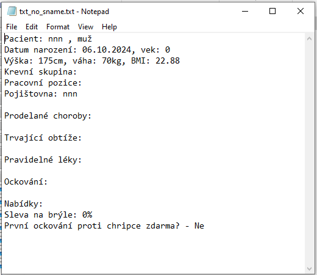
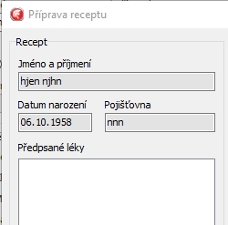

# Hlášení o nalezených chybách v aplikaci TesterIS3.exe

**1. ID chyby: 3**

2. Shrnutí: Nedostatečná sleva na brýle nezávisle na pohlaví.

3. Popis: V sekci "Nabídky" v poli nadepsaném "Sleva na brýle" není vyplněna správná hodnota slevy na brýle, je-li pacient/pacientka věku 50 let.

4. Kroky: Vyplnění pole "Datum narození" datem narození 50 pacienta/pacientky (např. k dnešnímu dni datum mezi 05.10.1973 - 04.10.1974), proběhne automatický výpočet v poli "Věk". 

5. Výsledky: V sekci "Nabídky" v poli nadepsaném "Sleva na brýle" je hodnota "20%". 

6. Očekávané výsledky: V sekci "Nabídky" v poli nadepsaném "Sleva na brýle" je hodnota 30%.

7. Zpracovala: Zdenka Herová

8. Datum zpracování: 04.10.2024

9. Vyřídí:

10. Urgence: hlavní

11. Priorita: urgentní

12. Ovlivněná verze: TesterIS3

13. Datum vyřešení:

14. Status: Open

15. Přílohy:

**1. ID chyby: 5**

2. Shrnutí: Kolonka očkování proti chřipce nezaškrtnuta za určitých podmínek.

3. Popis: Je-li karta vyplněna údaji: Muž", sekce "Očkování" - řádek "Chřipka", sloupec "Poslední" pole pro zaškrtnutí u data zaškrnuto, není zaškrtnuto zaškrtávací políčko s popiskem "První očkování proti chřipce zdarma?" v sekci "Nabídky" nezávisle na hodnotě v poli "Věk".

4. Kroky: Vyplnění karty zahrnuje tyto podmínky: "Datum narození" obsahuje datum udávající věk pacienta 25 až 50 let včetně, zaškrtnutí možnosti "Muž", sekce "Očkování", řádek "Chřipka", sloupec "Poslední" pole pro zaškrtnutí u data zaškrnuto.

5. Výsledky: Není zaškrtnuto zaškrtávací políčko s popiskem "První očkování proti chřipce zdarma?" v sekci "Nabídky".

6. Očekávané výsledky: Zaškrtávací políčko s popiskem "První očkování proti chřipce zdarma?" v sekci "Nabídky" je zaškrtnuto.

7. Zpracovala: Zdenka Herová

8. Datum zpracování: 04.10.2024

9. Vyřídí:

10. Urgence: hlavní (major)

11. Priorita: urgentní (urgent)

12. Ovlivněná verze: TesterIS3

13. Datum vyřešení:

14. Status: Open

15. Přílohy:

**1. ID chyby: 6**

2. Shrnutí: Přes nekompletní vyplnění povinných údajů jsou data odeslána k tisku.

3. Popis: V rozporu se zadáním recept nemusí obsahovat všechny povinné údaje pacienta/pacientky. Přestože není vyplněné pole "Pojišťovna" v sekci "Základní údaje", jsou data odeslána k tisku.

4. Kroky: Vyplnit pole "Jméno", "Příjmení" sekci "Základní údaje". Stisknout tlačítko "Připravit recept na léky", stisknout tlačítko "Vytisknout a zavřít".

5. Výsledky: Objeví se informativní okno informující o odeslání dat k tisku na tiskárnu.

6. Očekávané výsledky: Data se neodešlou k tisku.

7. Zpracovala: Zdenka Herová

8. Datum zpracování: 06.10.2024

9. Vyřídí:

10. Urgence: hlavní (major)

11. Priorita: urgentní (urgent)

12. Ovlivněná verze: TesterIS3

13. Datum vyřešení:

14. Status: Open

15. Přílohy:

**1. ID chyby: 7**

2. Shrnutí: Pravidelně užívané léky nejsou nijak upřednostněny. Viz poznámka ve složce README.md.

3. Popis: V rozporu se zadáním nejsou pravidelně užívané léky ve výčtu léků nijak upřednostněny. Jejich umístění na konci seznamu léků "Přidat na předpis" v okně "Pravidelné léky" je nedostatečná prioritizace.

4. Kroky: Do pole nadepsaného "Pravidelné léky" napsat název léku, stisknout tlačítko "+", stisknout tlačítko "Připravit recept na léky".

5. Výsledky: Objeví se okno "Příprava receptu", v seznamu "Přidat na předpis" jsou zahrnuty pravidelně užívané léky a nejsou nijak upřednostněny. 

6. Očekávané výsledky: Léky na přepis nějakým způsobem upřednostnit.

7. Zpracovala: Zdenka Herová

8. Datum zpracování: 06.10.2024

9. Vyřídí:

10. Urgence: hlavní

11. Priorita: urgentní

12. Ovlivněná verze: TesterIS3

13. Datum vyřešení:

14. Status: Open

15. Přílohy: 

**1. ID chyby: 10**

2. Shrnutí: Do textového souboru není zaznamenán kompletní seznam prodělaných chorob.

3. Popis: Po exportu zdravotní karty do textového souboru není do výčtu prodělaných nemocí nezaznamenána tuberkulóza. Tuberkulóza chybí ve všech formátech kódování textového souboru. V různých kombinacích zaškrtnutých nemocí tuberkulóza vždy chybí.

4. Kroky: Vyplnění základních povinných informací pacienta/pacientky, zaškrtnutí pole "Tuberkulóza" pod názvem "Prodělané choroby", 

5. Výsledky: Do textového souboru není zaznamenán kompletní seznam prodělaných chorob, konkrétně chybí tuberkulóza ve všech formátech kódování textového souboru. V různých kombinacích zaškrtnutých nemocí tuberkulóza vždy chybí.

6. Očekávané výsledky:

7. Zpracovala: Zdenka Herová

8. Datum zpracování: 06.10.2024

9. Vyřídí:

10. Urgence: hlavní

11. Priorita: urgentní

12. Ovlivněná verze: TesterIS3

13. Datum vyřešení:

14. Status: Open

15. Přílohy: 

**1. ID chyby: 12**

2. Shrnutí: Export textového souboru bez povinných informací. Viz poznámka ve složce README.md.

3. Popis: Zdravotní kartu je možné exportovat do textového souboru, přestože v ní nejsou vyplněna povinná pole. Na druhou stranu v zadání není specifikována podmínka kompletního vyplnění karty.

4. Kroky: Neúplné vyplnění základních povinných informací pacienta/pacientky, stisknutí tlačítka "Export karty do TXT".

5. Výsledky: Vytvoří se textový soubor s neúplnými povinnými údaji.

6. Očekávané výsledky: Objeví se chybová hláška upozorňující na nevyplněná povinná pole, textový soubor se nevytvoří.

7. Zpracovala: Zdenka Herová

8. Datum zpracování: 06.10.2024

9. Vyřídí:

10. Urgence: hlavní/normální

11. Priorita: urgentní/vysoká

12. Ovlivněná verze: TesterIS3

13. Datum vyřešení:

14. Status: Open

15. Přílohy: 

**1. ID chyby: 4**

2. Shrnutí: Nepočítá se slevami na brýle pro lidi věku 101 let a starší.

3. Popis: Podmínka ze zadání: "pro pacienty od 70 let je sleva 50%" je splněna pouze do 100 let věku nezávisle na pohlaví. Zadání ale neudává horní hranici věku.

4. Kroky: Vyplnění pole "Datum narození" datem narození paacienta/pacientky udávající věk 101 let a více, proběhne automatický výpočet v poli "Věk". 

5. Výsledky: Hodnota v poli "Věk" je 101 a vyšší, v sekci "Nabídky" v poli "Sleva na brýle" je hodnota "0%"

6. Očekávané výsledky: Je-li hodnota v poli "Věk" 70 a vyšší, v sekci "Nabídky" v poli "Sleva na brýle" je hodnota "50%"

7. Zpracovala: Zdenka Herová

8. Datum zpracování: 04.10.2024

9. Vyřídí:

10. Urgence: hlavní

11. Priorita: vysoká

12. Ovlivněná verze: TesterIS3

13. Datum vyřešení:

14. Status: Open

15. Přílohy:

**1. ID chyby: 9**

2. Shrnutí: V okně "Příprava receptu" překlep v názvu textového pole "Předepsané léky".

3. Popis: V okně "Příprava receptu" je překlep v popisku textového pole "Předpsané léky". V popisku chybí "e" ve slově "Předepsané".

4. Kroky: Stisknout tlačítko "Připravit recept na léky". 

5. Výsledky: Objeví se okno "Příprava receptu", v němž v nadpisu textového pole ve slově "Předpsané" chybí "e".

6. Očekávané výsledky: Nadpis textového pole zní "Předepsané léky".

7. Zpracovala: Zdenka Herová

8. Datum zpracování: 06.10.2024

9. Vyřídí:

10. Urgence: normální

11. Priorita: vysoká

12. Ovlivněná verze: TesterIS3

13. Datum vyřešení:

14. Status: Open

15. Přílohy: 

**1. ID chyby: 11**

2. Shrnutí: Chybová hláška neupozorňuje na všechna nevyplněná povinná pole po kliknutí na "Připravit recept na léky".

3. Popis: Přestože chybí povinný údaj "Pojišťovna", chybová hláška neupozorňuje na toto nevyplněné povinné pole po kliknutí na "Připravit recept na léky".

4. Kroky: Vyplnit pole "Jméno", "Příjmení" sekci "Základní údaje". Stisknout tlačítko "Připravit recept na léky".

5. Výsledky: Objeví se okno "Příprava receptu" s prázdným polem "Pojišťovna" v sekci "Recept".

6. Očekávané výsledky: Objeví se chybová hláška o nevyplněném poli "Pojišťovna". 

7. Zpracovala: Zdenka Herová

8. Datum zpracování: 05.10.2024

9. Vyřídí:

10. Urgence: normální

11. Priorita: vysoká

12. Ovlivněná verze: TesterIS3

13. Datum vyřešení:

14. Status: Open

15. Přílohy:

**1. ID chyby: 1**

2. Shrnutí: Počáteční malé písmeno ve jméně, příjmení, názvu pojišťovny.

3. Popis: Vyplňování údajů o pacientovi/pacientce by bylo praktičtější, jestliže pro text v polích pro zadání jména, příjmení, názvu pojišťovny a léků bude podmínka velkého počátečního písmena.

4. Kroky: Stisknutí tlačítka "Nový", vyplnění údajů, stisknutí tlačítka "Uložit osobu", uložení souboru.

5. Výsledky: Názvy, jméno, příjmení se uloží i po jejich vyplnění s počátečním malým písmenem.

6. Očekávané výsledky: Chybová hláška upozorní na malá písmena na počátku jména, příjmení, názvu.

7. Zpracovala: Zdenka Herová

8. Datum zpracování: 04.10.2024

9. Vyřídí:

10. Urgence: vedlejší

11. Priorita: nízká

12. Ovlivněná verze: TesterIS3

13. Datum vyřešení:

14. Status: Open

15. Přílohy:

**1. ID chyby: 2**

2. Shrnutí: Údaje v kartě pacienta/pacientky se neaktualizují, ale vytvoří se nový soubor.

3. Popis: Tlačítka "Nový" a "Uložit osobu" tak vlastně slouží k téže funkci. Je třeba přepsat již vytvořenou kartu pacienta/pacientky. Z praktického hlediska by se měly změny v kartě uložit do stávající karty po stisknutí tlačítka "Uložit osobu".

4. Kroky: Stisknutí tlačítka "Načíst osobu", vybrání souboru s kartou pacienta/pacientky, změna hodnot v polích, stisknutí tlačítka "Uložit osobu".

5. Výsledky: V případě, že karta pacienta/pacientky již existovala a byly pouze změněny některé údaje, je třeba původní složku s kartou přepsat novou složkou s kartou.

6. Očekávané výsledky: Nový soubor s kartou se vytvoří pouze po použití tlačítka "Nový". Po načtení existující karty a uložení téže karty s úpravami, se karta aktualizuje bez nutnosti přepsat složku.

7. Zpracovala: Zdenka Herová

8. Datum zpracování: 04.10.2024

9. Vyřídí:

10. Urgence: vedlejší

11. Priorita: nízká

12. Ovlivněná verze: TesterIS3

13. Datum vyřešení:

14. Status: Open

15. Přílohy:

**1. ID chyby: 8**

2. Shrnutí: Označení více názvů léků ze seznamu najednou. Viz poznámka ve složce README.md.

3. Popis: Pro praktické použití aplikace v okně "Příprava receptu", v seznamu "Přidat na předpis" je vhodné umožnit označení více než jednoho názvu léků. např. stiskem a držením klávesy "Shift" a současným klikáním na názvy léků.

4. Kroky: Vyplnit základní údaje. Stisknout tlačítko "Připravit recept na léky", kliknutím na název léku v seznamu nadepsaném "Přidat na předpis" označit léky stisknout tlačítko "Přidat".

5. Výsledky: Název léku se přidá do pole nadepsaného "Předpsané léky".

6. Očekávané výsledky: Umožněním vybrání více názvů léků najednou bude proces předepisování více léků najednou praktičtější.

7. Zpracovala: Zdenka Herová

8. Datum zpracování: 06.10.2024

9. Vyřídí:

10. Urgence: vedlejší

11. Priorita: nízká

12. Ovlivněná verze: TesterIS3

13. Datum vyřešení:

14. Status: Open

15. Přílohy: